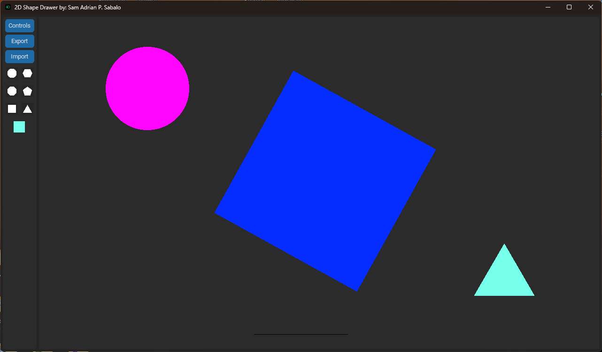
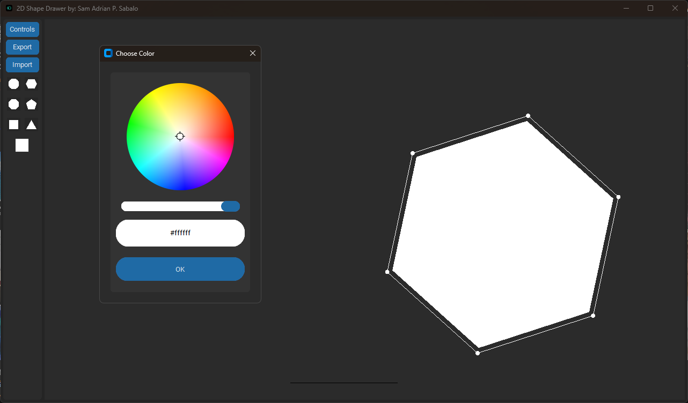

# 2D Shape Drawer App

Welcome to the 2D Shape Drawer App! Before you can start using the app, please follow these instructions carefully.

## Prerequisites
- Make sure you have the latest version of Python installed on your system.
- (Optional) Create a virtual environment.

## Installation
1. Clone or download this repository to your local machine.
2. Open a terminal or command prompt and navigate to the project's root directory.

   ```shell
   cd path/to/2D-Shape-Drawer

3. Install the required libraries from the requirements.txt file using pip:

   ```shell
   pip install -r requirements.txt

## Running the App

    python app.py

The App should now load and you should now be able to use the app

## Features

- Add shapes
- Resize shapes
- Rotate shapes
- Move shapes
- Change color
- Delete shapes
- Import and export current work
- Key bindings
  
## Future Improvements

- Implement more options for shape customization
- Resize width and height separately
- Implement undo/redo functionality
- Implement active usage of mouse for interaction
- Add support for more shapes and customizable shapes
- Enhance import/export functionality with additional file formats

## Images




## Acknowledgements

[CTkColorPicker](https://github.com/Akascape/CTkColorPicker): A much better color picker when it comes to UI than the default Tkinter color picker.

## License

This project is licensed under the GNU General Public License v3.0 - see the [LICENSE](LICENSE) file for details.

The GPL-3.0 license grants users the freedom to use, modify, and distribute this software under certain conditions. It also requires that any modifications made to the software are also licensed under the GPL-3.0.

